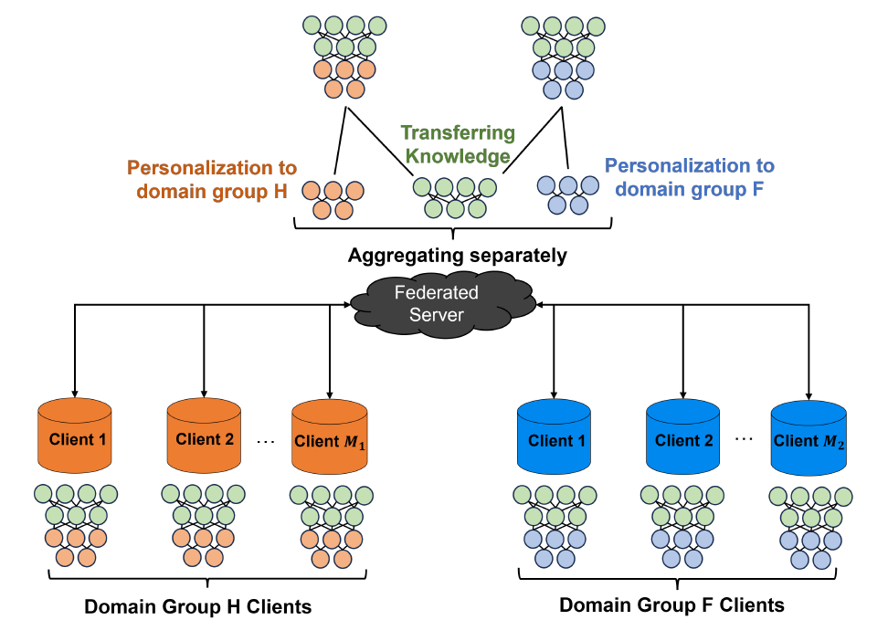
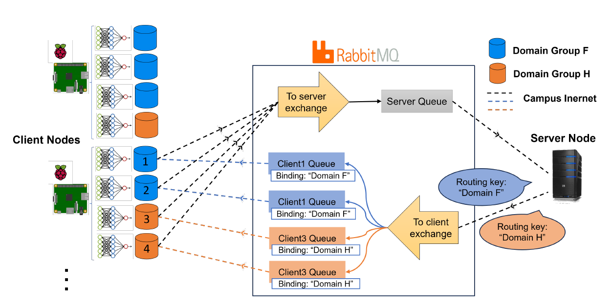

# Federated Domain Generalization Algorithm for Condition Monitoring (FDG-CM)

This repository presents the algorithm developed in the FDG_CM paper (previously named FTL-TP). This algorithm introduces a novel Federated Domain Generalization (FDG) paradigm specifically tailored for condition monitoring in manufacturing processes. Our framework has been tested on ultrasonic metal welding data but is designed to be extensible to other types of condition monitoring data.

## Paper Information

The paper associated with this repository has been accepted by the *Journal of Manufacturing Systems (JMS)* and is currently under review. Once finalized, it will provide a comprehensive overview of the FDG_CM algorithm and its applications.

## Repository Structure

- **src/**: Contains all client and server code.
- **run.py**: Script to execute all client codes. You can modify this script to select specific clients for execution on each edge device.

## Requirements

To run the FDG_CM algorithm, you will need:

- One CPU core per client node.
- For example, to run 16 clients, you will require 4 Raspberry Pis, each equipped with 4 CPU cores.
- [Docker](https://www.docker.com/) installed to manage and run containerized environments.
- [RabbitMQ](https://www.rabbitmq.com/) broker for message routing.
- Python (version 3.8 or higher) with necessary libraries (see `requirements.txt`).

## Installation and Setup

1. Install Docker and set up the RabbitMQ container.
   Replace `user`, `password`, and other parameters with your specific configurations.

2. Ensure that you modify the IP address, password, and virtual host settings in the code to match your environment before running the application.

## Instructions

1. Navigate to the `src/` folder.
2. Modify the client scripts to use the data of your choice.
3. Use the `run.py` script to execute the desired clients.

Feel free to customize `run.py` and other files according to your deployment needs.

## Federated Learning Paradigm

In this implementation, we built the federated learning paradigm from scratch to ensure the flexibility needed for our specific use case and to implement the custom algorithms presented in the paper. The paradigm allows for the integration of multiple edge devices, each running its local model, while only sharing model updates with a central server, thereby preserving data privacy.

### Paradigm Overview

Our framework enables knowledge transfer between at least two domain groups with the same feature space. By training the initial layers across various domain groups, the model collaboratively extracts low-level features from the common feature space, thus broadening the data pool for shared layers and allowing them to learn from different domains. The framework then personalizes the final model for each domain group by training a set of upper layers on data from clients within the same domain group. This results in a comprehensive neural network (NN) model with shared and task-specific components.

### Edge Cloud Architecture

The edge-cloud architecture implemented in this paradigm supports efficient federated learning across multiple distributed devices. The architecture consists of edge devices (such as Raspberry Pis or other edge computing units) that locally process and train models on their own data. These edge devices only share model updates (gradients or parameters) with a central server located in the cloud, which aggregates these updates to improve a global model.

The architecture enhances privacy by ensuring that raw data never leaves the local edge devices, and only model updates are shared. This approach is particularly suitable for manufacturing settings, where data privacy and latency are critical concerns.

The diagrams below illustrate the federated learning framework and edge-cloud architecture:

*Figure: Illustration of the proposed FDG-CM structure. The number of classes and neuron count in the personalized layers (blue and orange) can vary for each domain group.*

This approach is designed to improve the performance of the final models, particularly in tasks requiring domain generalization. Unlike other approaches, such as FedPer, which restricts collaboration by not sharing personalized layers, our framework enables separate aggregation of common personalized layers among clients with identical tasks and domain groups.

## Data Availability

The data used in this research is private and can be made available upon reasonable request.

## Author Links

- [Link to the Arxiv paper](https://arxiv.org/abs/2404.13278)
